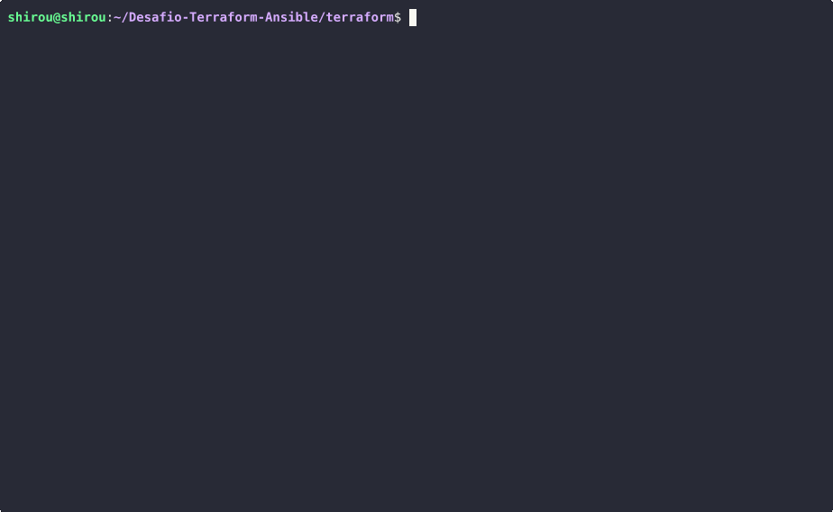

# Desafio-Terraform-Ansible

Este repositório contém a documentação e os arquivos do desafio do Bootcamp DevOps da Atlântico Avanti, que consistiu em automatizar a criação e configuração de máquinas virtuais.

O projeto utiliza:

- Proxmox VE como hypervisor para gerenciamento das VMs;

- Terraform para provisionamento automatizado e consistente das VMs;

- Ansible para configuração e deploy de serviços, garantindo que as máquinas fiquem prontas para uso.


## 📌 Etapa 1 – Criando o Template Arch Linux no Proxmox

Nesta primeira etapa, vamos preparar um **template base** do Arch Linux no Proxmox. Esse template será usado posteriormente pelo Terraform para criar VMs de forma automatizada.

### 🔧 Pré-requisitos

- Um servidor com **Proxmox VE** instalado e acessível.  
- Acesso **root** ao Proxmox.  


### 📥 Script de criação do template

O script [`create-arch-vm.sh`](./scripts/create-arch-template.sh) automatiza o processo de:

1. Download da imagem cloud do Arch Linux.
2. Customização da imagem com `virt-customize` (instalação do `qemu-guest-agent`).
3. Criação de uma VM no Proxmox com as configurações básicas.
4. Importação e resize do disco.
5. Habilitação do **cloud-init** e QEMU Guest Agent.
6. Conversão da VM em **template** (`ArchLinux-cloud-init`).

### ▶️ Como usar

```bash
git clone https://github.com/LuisCarlosJp/Desafio-Terraform-Ansible.git
cd Desafio-Terraform-Ansible/scripts/
chmod +x create-arch-template.sh
./create-arch-template.sh
```


Após a execução, você terá um **template Arch Linux** (`ArchLinux-cloud-init`) criado no Proxmox, pronto para ser usado pelo Terraform.

### ⚙️ Configurações padrão do template

- **VM ID:** 9001  
- **Nome:** ArchLinux-cloud-init  
- **CPU:** 1 core (host)  
- **Memória:** 3 GB  
- **Disco:** 100 GB (expandido a partir da imagem original)  
- **Rede:** VirtIO bridge `vmbr0`  
- **Cloud-init:** habilitado

## 📌 Etapa 2 – Criando usuário e token Terraform

O Terraform precisa de um usuário com permissões específicas para provisionar VMs no Proxmox.

### 📥 Script de criação do template

O script [`create-terraform-user.sh`](./scripts/create-terraform-user.sh) automatiza o processo de:

1. Cria uma role `TerraformProv` com permissões necessárias.
2. Cria o usuário `terraform-prov@pve`.
3. Cria um token para autenticação do Terraform.
4. Associa a role ao usuário no Proxmox.


### ▶️ Como usar

```bash
chmod +x create-terraform-user.sh
./create-terraform-user.sh
```
Após execução, anote o **token** e **ID** que será utilizado posteriormente

## 📌 Etapa 3 – Provisionando VMs com Terraform

Após ter o template Arch Linux pronto e o usuário/token do Terraform configurados no Proxmox, podemos criar máquinas virtuais automatizadas usando Terraform.

🔧 Pré-requisitos

Antes de rodar o Terraform, é necessário garantir:

1. Ter uma chave SSH pública disponível (`~/.ssh/id_rsa.pub`) para que o Terraform possa configurar acesso seguro à VM.

2. Criar um arquivo `credentials.auto.tfvars` para sobrescrever valores sensíveis e específicos do seu ambiente. Por exemplo:

```bash
proxmox_api_url        = "https://ip-do-seu-proxmox:8006/api2/json"
proxmox_api_token_id   = "terraform-prov@pve!mytoken"
proxmox_api_token_secret = "SEU_TOKEN_SECRETO"

vm_name        = "MeuServidorArch"
vm_target_node = "v2"
vm_ci_user     = "MeuUsuario"
vm_ssh_key_path = "~/.ssh/minha_chave.pub"
```
Observação: valores definidos no `credentials.auto.tfvars` sobrescrevem os defaults do `variables.tf`. Isso permite criar múltiplas VMs com configurações diferentes sem alterar os arquivos principais do Terraform.

Estrutura do Terraform no projeto

O seu projeto está organizado com os seguintes arquivos principais para o Terraform:

1. `provider.tf` – Define o provider (Proxmox) e a autenticação.

2. `variables.tf` – Contém todas as variáveis configuráveis para a VM.

3. `vm.tf` – Define o recurso da VM, usando o template cloud-init.

4. `outputs.tf` – Permite exibir informações importantes após o terraform apply.

### ▶️ Como usar

```bash
cd Desafio-Terraform-Ansible/terraform/
terraform init
terraform plan
terraform apply
```

### 🖥️ Execução do Terraform

Abaixo está uma captura de tela mostrando a execução do Terraform para provisionamento da VM, incluindo a inicialização, o plano e a aplicação das configurações.



Isso significa que o terraform rodou como sucesso e o endereço IP foi atribuido  à VM via DHCP corretamente, assim podendo se conectar à VM via SSH.
